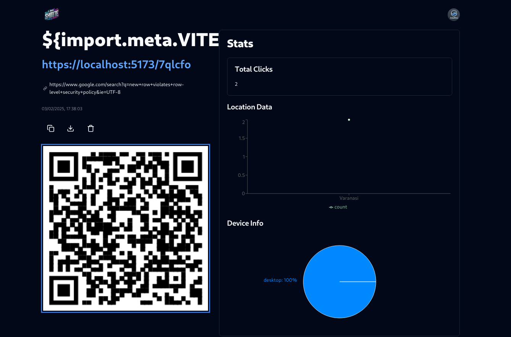

# Link Shotter

Link Shotter is a powerful and easy-to-use URL shortening application built with **React** for the frontend and **Squarebase** for the backend. With features like **click tracking** and the ability to create **custom shortened URLs**, Link Shotter is designed to streamline the process of shortening, managing, and tracking your links.



## Features

- **URL Shortening**: Generate short and manageable URLs from long links.
- **Custom Shortened URLs**: Create your own custom short URLs to personalize your links.
- **Click Tracking**: Track the number of times a shortened link has been clicked.
- **Fast and Responsive**: Built using modern technologies for speed and performance.
- **User-Friendly**: Intuitive interface for a seamless user experience.

## Project Structure

Here's an overview of the project structure:

```bash

├── components.json
├── fx.sh
├── index.html
├── jsconfig.json
├── package.json
├── postcss.config.js
├── public
│   ├── banner1.png
│   ├── banner2x.jpg
│   ├── banner3x.jpg
│   └── logo.png
├── README.md
├── src
│   ├── App.css
│   ├── App.jsx
│   ├── components
│   │   ├── create-link.jsx
│   │   ├── crousel.jsx
│   │   ├── device-stats.jsx
│   │   ├── error.jsx
│   │   ├── header.jsx
│   │   ├── link-card.jsx
│   │   ├── location-stats.jsx
│   │   ├── login.jsx
│   │   ├── require-auth.jsx
│   │   ├── signup.jsx
│   │   └── ui
│   │       ├── accordion.jsx
│   │       ├── avatar.jsx
│   │       ├── button.jsx
│   │       ├── card.jsx
│   │       ├── dialog.jsx
│   │       ├── dropdown-menu.jsx
│   │       ├── input.jsx
│   │       └── tabs.jsx
│   ├── context.jsx
│   ├── db
│   │   ├── apiAuth.js
│   │   ├── apiClicks.js
│   │   ├── apiUrls.js
│   │   └── supabase.js
│   ├── hooks
│   │   └── use-fetch.js
│   ├── index.css
│   ├── layouts
│   │   └── app-layout.jsx
│   ├── lib
│   │   └── utils.js
│   ├── main.jsx
│   └── pages
│       ├── auth.jsx
│       ├── dashboard.jsx
│       ├── landing.jsx
│       ├── link.jsx
│       └── redirect-link.jsx
├── structure.txt
├── tailwind.config.js
├── vite.config.js
└── yarn.lock
```

- .env sample
```bash
VITE_SUPABASE_URL=" "
VITE_SUPABASE_KEY= " "
VITE_DOMAIN = " "
```
- You can customize the sections based on your project's specific details and setup! Let me know if you need further adjustments.
